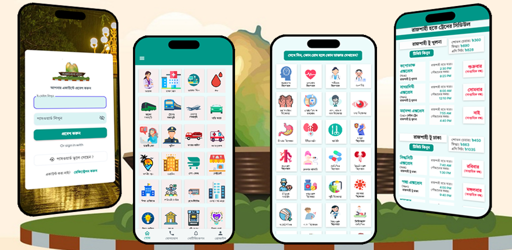
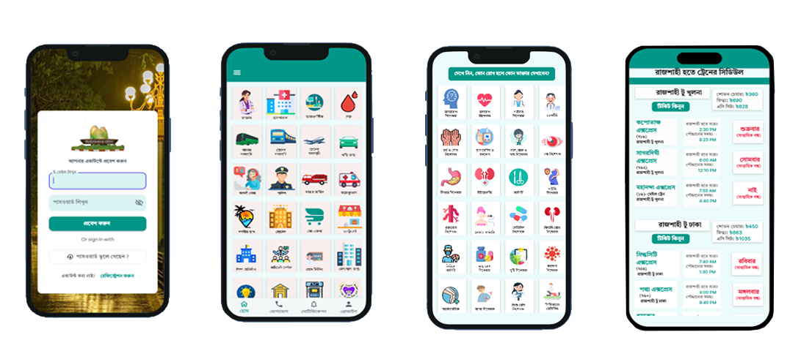

 Rajshahi City App - Your Guide to Rajshahi!
 
<h1 align="center">Rajshahi City App</h1>

  A feature-rich guide to explore the beautiful city of Rajshahi. 

  
  
  

---

<!-- Your content here -->
<!-- Example: Features, Installation, Screenshots, etc. -->

<!--Banner-->

<!--Night Owl image-->

  

<!--Header Name-->
#  Rajshahi City App! 
*Comprehensive Lifestyle App for Rajshahi Residents*
  

<!--Start Intro-->               

The Rajshahi City App is a free Android application designed to streamline access to essential services for residents of the Rajshahi district. This lifestyle app encompasses a wide range of features, including product buying and selling, doctor appointment bookings, and real estate transactions. Users can conveniently check train and bus schedules, as well as explore local tourist attractions, all from their mobile device. 

Additionally, the app offers vital community services such as emergency blood donation assistance and contact details for police and fire services. It also facilitates vehicle rentals and provides job notifications, along with contact information for home tutors, mechanics, and restaurants. With 24/7 support available, the Rajshahi City App serves as a comprehensive resource for daily needs, enhancing the quality of life for its users.

 

- ➡️ [DOWNLOAD APP](https://apkpure.com/p/com.mycompany.rajshahicity) 
- ➡️ [DOWNLOAD APP](https://withishtiaq.itch.io/rajshahi-city)

<!--End Intro-->

<!--Profile Count Badge-->

---

<!--Languages and Tools Section-->       
<h2 align="center">Screen Shot</h2> 
<h3 align="left"> Description </h3>  

Rajshahi City App is a mobile application developed to help users explore the beautiful city of Rajshahi. Whether you're a tourist or a local, this app provides essential information, travel tips, and locations around Rajshahi. Download the APK now and start exploring!

<picture>

  
</picture>
 

  
---

  <b>Developer <a href="https://www.facebook.com/ishtiaq.ahmed19" target="_blank">Ishtiaq Ahmed</a></b>  
  
  
  

---
